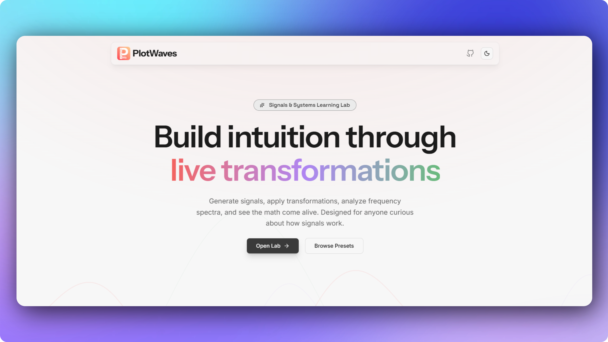
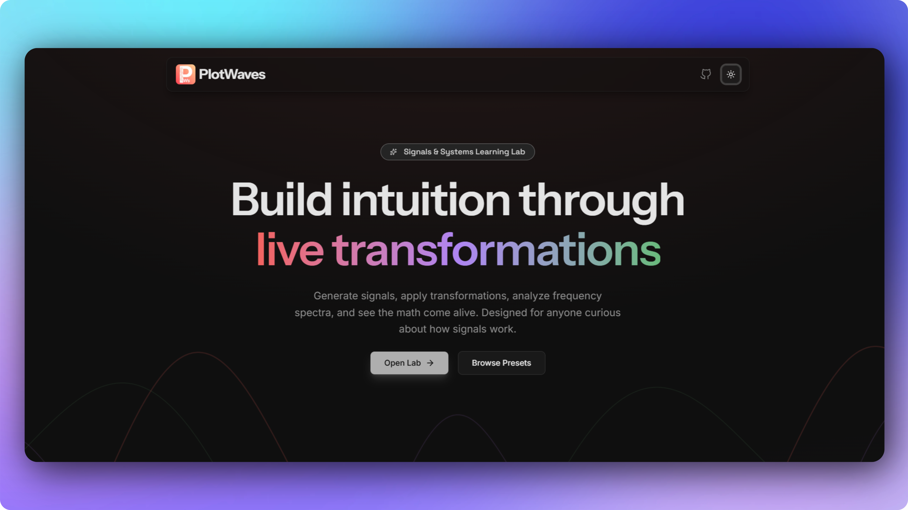
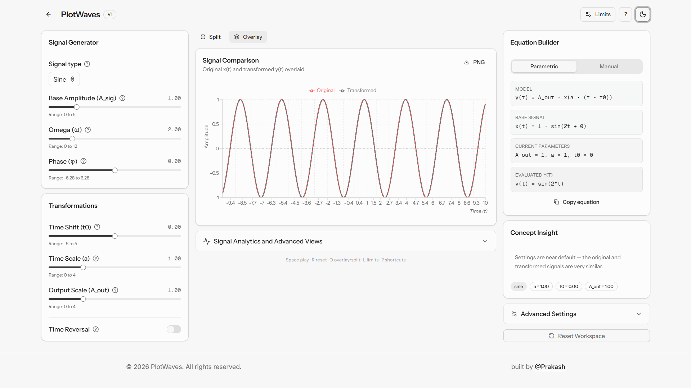
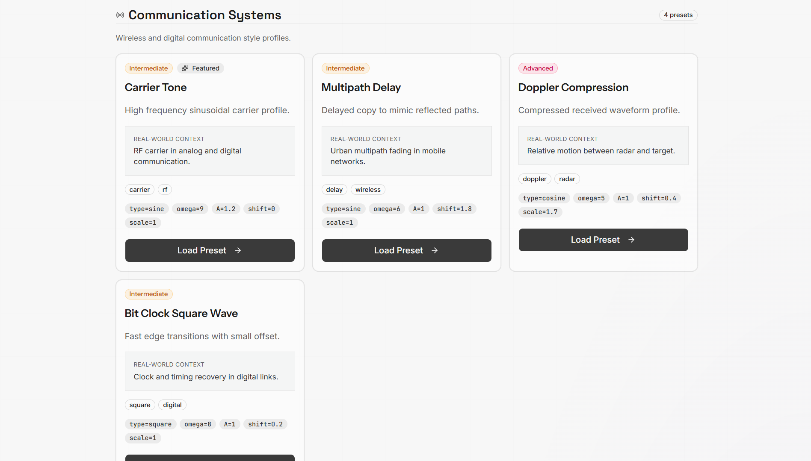

# PlotWaves

Interactive Signals and Systems learning lab.

PlotWaves helps you generate signals, apply transformations, analyze behavior, and build intuition visually in the browser.

  
<!--    -->
## Lab Workspace
  
## Presets

## Features

- Signal generation: sine, cosine, square, step, ramp, exponential
- Real-time transformations: shift, scale, reversal, amplitude scaling
- Equation view and manual expression mode
- Split and overlay chart modes
- PNG chart export
- Signal analysis: RMS, energy, peak-to-peak, zero crossings, frequency spectrum
- Even and odd decomposition
- Convolution animator with guided steps
- Curated real-world presets by category

## Tech Stack

- Next.js
- React
- TypeScript
- Tailwind CSS
- shadcn/ui
- Framer Motion
- Recharts

## Pages

- Home
- Lab
- Presets
